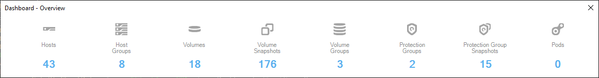
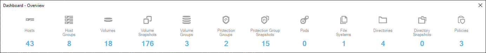
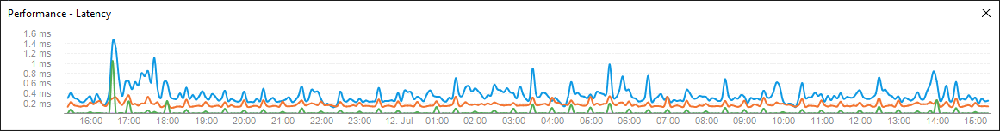
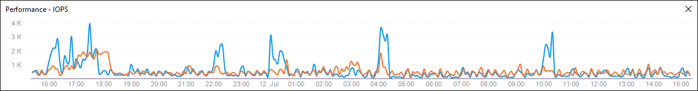
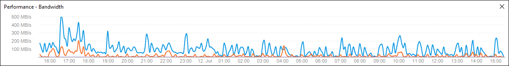
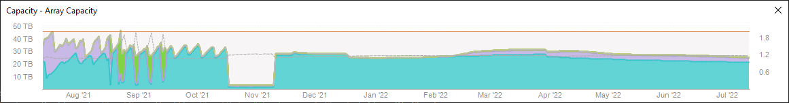
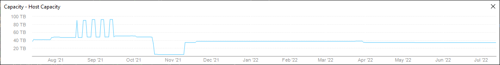
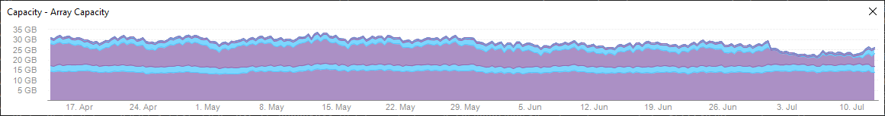
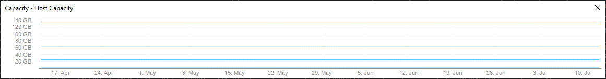

# PureStorage.FlashArray.Reporting
PowerShell Reporting Module for the Pure Storage REST API using MS Charts.

## Key Features and Benefits:

    * Easily create charts that can be saved, emailed, or displayed on-screen
    * Works on both Windows PowerShell (5.1) and PowerShell Core (6+) (Windows Only)
    * Create reports that contain multiple charts
    * Query the Pure Storage REST API directly, no additional modules required
    * Example scripts to help get you started

## Installation 
Automatic (via PowerShell Gallery)
```powershell
Install-Module PureStorage.FlashArray.Reporting
Import-Module PureStorage.FlashArray.Reporting

# Get commands in the module
Get-Command -Module PureStorage.FlashArray.Reporting
```
Manual (via GitHub)
```powershell
# Download and Unblock the latest .zip file
# Extract the PureStorage.FlashArray.Reporting folder to a module path (e.g. $env:USERPROFILE\Documents\WindowsPowerShell\Modules\

Import-Module $env:USERPROFILE\Documents\WindowsPowerShell\Modules\PureStorage.FlashArray.Reporting

# Get commands in the module
Get-Command -Module PureStorage.FlashArray.Reporting
```
## Usage (Quick Start)
### Connect to the Purity REST API
```powershell
$Credential = Get-Credential
$FlashArray = Connect-PfaApi -ArrayName "array01.contoso.local" -Credential $Credential
```

### Dashboard - Capacity Chart
```powershell
$SpaceMetrics = Get-PfaChartData -Array $FlashArray -Type Dashboard -ChartName Capacity
New-PfaChart -Type Dashboard -ChartName Capacity -ChartData $SpaceMetrics -AsChart | Show-PfaChart
```
[](Images/Dashboard-Capacity.png)

### Dashboard - Overview Chart
```powershell
$OverviewMetrics = Get-PfaChartData -Array $FlashArray -Type Dashboard -ChartName Overview
New-PfaChart -Type Dashboard -ChartName Overview -ChartData $OverviewMetrics -AsChart | Show-PfaChart
```
[](Images/Dashboard-Overview.png)
```powershell
New-PfaChart -Type Dashboard -ChartName Overview -ChartData $OverviewMetrics -AsChart -Property "Hosts", "Host Groups", "Volumes", "Volume Snapshots", "Volume Groups", "Protection Groups", "Protection Group Snapshots", "Pods", "File Systems", "Directories", "Directory Snapshots", "Policies"| Show-PfaChart
```
[](Images/Dashboard-Overview-All.png)
### Performance - Charts
```powershell
$Performance = Get-PfaChartData -Array $FlashArray -Type Performance -Group Array
```
Latency
```powershell
New-PfaChart -Type Performance -Group Array -ChartName Latency -ChartData $Performance -Property "Read","Write" -AsChart | Show-PfaChart
```
[](Images/Performance-Latency.png)
IOPS
```powershell
New-PfaChart -Type Performance -Group Array -ChartName IOPS -ChartData $Performance -AsChart | Show-PfaChart
```
[](Images/Performance-IOPS.png)
Bandwidth
```powershell
New-PfaChart -Type Performance -Group Array -ChartName Bandwidth -ChartData $Performance -AsChart | Show-PfaChart
```
[](Images/Performance-Bandwidth.png)
### Replication Bandwidth
```powershell
$ReplicationMetrics = Get-PfaChartData -Array $FlashArray -Type Replication -Group Array
New-PfaChart -Type Replication -ChartName Bandwidth -ChartData $ReplicationMetrics -AsChart | Show-PfaChart
```
[](Images/Replication-Bandwidth.png)

### Capacity Charts - Overall Array (1 year)
```powershell
$SpaceMetrics = Get-PfaChartData -Array $FlashArray -Type Capacity -Group Array -Historical 1y
```
Array Capacity
```powershell
New-PfaChart -Type Capacity -Group Array -ChartData $SpaceMetrics -ChartName 'Array Capacity' -AsChart | Show-PfaChart
```
[](Images/Capacity-Array-ArrayCapacity.png)
Host Capacity
```powershell
New-PfaChart -Type Capacity -Group Array -ChartData $SpaceMetrics -ChartName 'Array Capacity' -AsChart | Show-PfaChart
```
[](Images/Capacity-Array-HostCapacity.png)

### Capacity Charts - Volumes or Volume Groups (90 days)
```powershell
$SpaceMetrics = Get-PfaChartData -Array $FlashArray -Type Capacity -Group Volumes -Historical 90d -Name "*your_vg*"
```
Array Capacity
```powershell
New-PfaChart -Type Capacity -Group Volumes -ChartData $SpaceMetrics -ChartName 'Array Capacity' -AsChart | Show-PfaChart
```
[](Images/Capacity-Volumes-ArrayCapacity.png)
Host Capacity
```powershell
New-PfaChart -Type Capacity -Group Volumes -ChartData $SpaceMetrics -ChartName 'Host Capacity' -AsChart | Show-PfaChart
```
[](Images/Capacity-Volumes-HostCapacity.png)

### Disconnect from the Purity REST API
```powershell
Disconnect-PfaApi -Array $FlashArray
```
## Example Scripts
Example scripts are included in the Examples folder off of the main module root folder. It is recommended that they be copied to your typical "scripts" folder so if you make any adjustments they aren't overriden by an update.

### New-PfaProtectionGroupReport.ps1
Lists protections groups across a single or multiple arrays, grouped by array, with snapshot and replication settings.
```powershell
New-PfaProtectionGroupReport -Array "array01.contoso.local","array02.contoso.local" -Credential (Get-Credential)
```
[](Images/New-PfaProtectionGroupReport.png)

### New-PfaVolumeReport.ps1
Lists volumes across a single or multiple arrays, grouped by array, with usage and growth rate from the array's performance counters.
```powershell
New-PfaVolumeReport -Array "array02.contoso.local" -Credential (Get-Credential) -ShowTotals
```
[](Images/New-PfaVolumeReport.png)
** HTML colorization is handled via a separate module named [PS2HTMLTable](https://www.powershellgallery.com/packages/PS2HTMLTable) and is accessible from the [PowerShell Gallery](https://www.powershellgallery.com/packages/PS2HTMLTable). It is not required to run this script, but output will not be colored or highlighted.

### New-PfaStatusReport.ps1
This script is designed to be run daily to gather information and save it as json so it can be used for comparison data on tomorrow's report. You can optionally save the report as HTML and/or email it. Growth data will be auto populated when you cross its respective threshold.
```powershell
New-PfaStatusReport -Array "array02.contoso.local" -Credential (Get-Credential) -IncludeCharts All -SkipVolumesReport -SaveAsHTML
```
[](Images/New-PfaStatusReport.png)
** HTML colorization is handled via a separate module named [PS2HTMLTable](https://www.powershellgallery.com/packages/PS2HTMLTable) and is accessible from the [PowerShell Gallery](https://www.powershellgallery.com/packages/PS2HTMLTable). It is not required to run this script, but output will not be colored or highlighted.

## Usage (Advanced)
The REST API Guides are accessible via the Purity Web Gui in the side bar Help menu item. You can also access them directly (without logging in) at:   
REST API 2.x Guide: https://array01.contoso.local/static/0/help/rest2.0/fa2.x-api-reference.html   
REST API 1.x Guide: https://array01.contoso.local/static/0/help/rest/   
Replace array01.contoso.local with your array hostname or ip address.

Once connected with Connect-PfaApi, you can execute api queries via Invoke-PfaApiRequest.   

### List arrays (API 2.x)
```powershell
Invoke-PfaApiRequest -Array $FlashArray -Request RestMethod -Method Get -Path "/arrays"

name                 : ARRAY01
id                   : c139eafa-bfe2-4784-a0c7-1b64ee159bef
...
version              : 6.1.7
```
### List arrays (API 1.x)
```powershell
Invoke-PfaApiRequest -Array $FlashArray -Request RestMethod -Method Get -Path "/array" -ApiVersion 1

array_name : ARRAY01
id         : c139eafa-bfe2-4784-a0c7-1b64ee159bef
version    : 6.1.7
```
### List Volumes that match "names" (API 2.x)
```powershell
Invoke-PfaApiRequest -Array $FlashArray -Request RestMethod -Method Get -Path "/volumes?names=*a-volumes*,*b-volumes*"
```
### List Volumes that match "names" (API 1.x)
```powershell
Invoke-PfaApiRequest -Array $FlashArray -Request RestMethod -Method Get -Path "/volume?names=*a-volumes*,*b-volumes*"
```